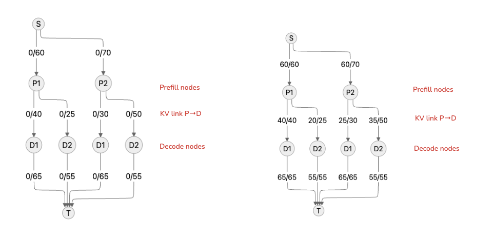

# autoscale-inference

> **Unofficial Implementation** of the **Edmonds–Karp Max-Flow** algorithm, adapted for **HexGen-2: Disaggregated Generative Inference of LLMs in Heterogeneous Environments**.
Paper: https://arxiv.org/abs/2502.07903

In the article, they apply Kernighan–Lin (Graph Partitioning), while for my simple proof of concept I used Edmonds–Karp (Max-Flow with BFS).

## 1. Path Selection Algorithm (Edmonds–Karp with BFS)


Left graph: shows the initial state with all flows equal to zero and only capacities labeled.
Right graph: shows the final state after applying the Edmonds–Karp algorithm: flows are distributed across P1 and P2 into D1 and D2, saturating both decode edges (D1→T, D2→T). The maximum flow of 120 is achieved after four augmenting paths fill the network until the decode stage becomes the bottleneck


Each step “pushes” flow along one path, limited by the **bottleneck capacity** (minimum remaining capacity on that path):

**Step 1: S → P1 → D1 → T**  
- Bottleneck = min(60, 40, 65) = **40**  
- Update:  
  - S→P1: 40/60  
  - P1→D1: 40/40  
  - D1→T: 40/65  

**Step 2: S → P1 → D2 → T**  
- Remaining: S→P1 (20), P1→D2 (25), D2→T (55) ⇒ bottleneck = **20**  
- Update:  
  - S→P1: 60/60  
  - P1→D2: 20/25  
  - D2→T: 20/55  

**Step 3: S → P2 → D1 → T**  
- Remaining: S→P2 (70), P2→D1 (30), D1→T (25 left) ⇒ bottleneck = **25**  
- Update:  
  - S→P2: 25/70  
  - P2→D1: 25/30  
  - D1→T: 65/65 (full)  

**Step 4: S → P2 → D2 → T**  
- Remaining: S→P2 (45), P2→D2 (50), D2→T (35 left) ⇒ bottleneck = **35**  
- Update:  
  - S→P2: 60/70  
  - P2→D2: 35/50  
  - D2→T: 55/55 (full)  

✅ All edges into **T** are now saturated.  
**Max-flow = 40 + 20 + 25 + 35 = 120.**


## 2. Final Flow Diagram (flow/capacity)

- P1 → D1: 40 / 40  
- P1 → D2: 20 / 25  
- P2 → D1: 25 / 30  
- P2 → D2: 35 / 50  
- D1 → T: 65 / 65  
- D2 → T: 55 / 55  


## 3. Interpretation: Routes & KV Transmission Schedule

The chosen routes were:

1. P1 → D1: 40  
2. P1 → D2: 20  
3. P2 → D1: 25  
4. P2 → D2: 35  

- Total through **D1** = 65 (maxed out)  
- Total through **D2** = 55 (maxed out)  
- Since the **decode → T edges** are saturated, the bottleneck is on the **decode side**.  

**KV transmission schedule** (relative frequency):  
- P1 → D1: 40/120 = 33.3%  
- P1 → D2: 20/120 = 16.7%  
- P2 → D1: 25/120 = 20.8%  
- P2 → D2: 35/120 = 29.2%  


## 4. Configuration Optimization Insights

- Both **D1→T** and **D2→T** are saturated. To increase throughput, you need to:  
  - (a) Increase **decode capacity** (e.g., more GPU decoders or larger batch size).  
  - (b) Expanding unused KV links (P1→D2 has 5 left, P2→D1 has 5 left, P2→D2 has 15 left) does **not** help if the decode outputs remain bottlenecked.  

- Even though **S→P2** still has 10 unused capacity (70 total, 60 used), downstream decode is full. Increasing prefill capacity won’t raise max-flow.  


👉 **Conclusion:** The **decode stage is the bottleneck**. To push throughput beyond 120, you must scale decoding.


# Simulation

```bash
python animations.py --ticks 300 --sla 50 --fps 6 --outfile lifecycle.gif
```

Output


